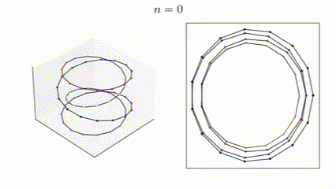
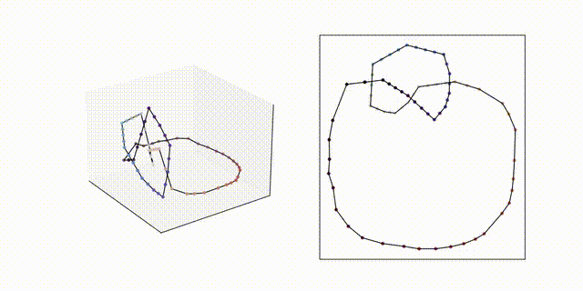
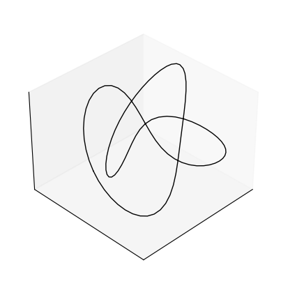
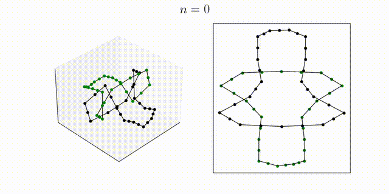

# numerical-knot-untangling
Read the paper [here](./assets/paper/numerical_knot_untangling.pdf).

This is a research project for untangling knots numerically, consisting of an implementation for the Möbius knot energy minimization.  
# Mobius energy
The **Möbius energy** is defined as such:

$$
\mathcal{E}(\gamma)=\iint _{M^{2}} \frac{1}{|\gamma(u)-\gamma(v) |^{2}}-\frac{1}{d(u,v)^{2}} \, dv \, du 
$$

where:
- $\gamma(u):M\to\mathbb{R}^{3}$ is a parameterized curve representing a knot.
- $u$ is the parameter and denotes a length along $\gamma$
- $d(u,v)$ denotes the shortest distance  between $u$ and  $v$ *along* the curve 

### Energy computation on 2D hourglass curve

Roughly, since the curve $\gamma$ is completely described by a list of vertices, we use the following system

$$
\gamma_t = -\nabla \mathcal{E}_\gamma
$$

Since we are iterating over a discrete set $M$ of $s$ values representing the indices of our vertices, the discretized energy $\hat{\mathcal{E}}$ is expressed by approximate the double integral by a double summation.

The gradient of this summation is computed and implemented in [mobius.py](mobius.py) as the function `Mobius_gradient`.

# Gradient flow approximation
Implements a simple forward Euler method with respect to the above system. 
The scheme includes an dynamic step size which bounds the spatial step size and helps with stability.

The main file is [mobius.py](mobius.py) which the Mobius energy gradient computation. \
The file [config.py](config.py) contains the configuration parameters for the Mobius energy gradient computation such as .obj file and visualization parameters.\
The file [curve.py](curve.py) contains the geometry manipulation function utility functions such as reading obj files.

## Results 
### Torus knot $T_{4,1}$ (untangles to the unknot)

### Overhand (untangles to the trefoil)

Trefoil for reference:

### Closed reef knot (untangles to two unknot components.)

