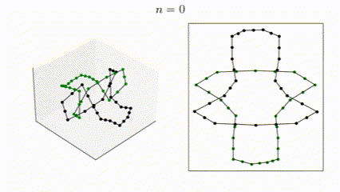
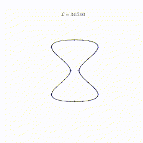

# numerical-knot-untangling

This is an ongoing research project for untangling knots numerically, currently consisting of an implementation for the Möbius knot energy minimization.  
# Mobius energy
The **Möbius energy** is defined as such:

$$
\mathcal{E}(\gamma)=\iint _{M^{2}} \frac{1}{|\gamma(u)-\gamma(v) |^{2}}-\frac{1}{d(u,v)^{2}} \quad dv \quad du 
$$

where:
- $\gamma(u):M\to\mathbb{R}^{3}$ is a parameterized curve representing a knot.
- $u$ is the parameter and denotes a length along $\gamma$
- $d(u,v)$ denotes the shortest distance  between $u$ and  $v$ *along* the curve 

Roughly, since the curve $\gamma$ is completely described by a list of vertices, we use the following system

$$
\gamma_t = -\nabla \mathcal{E}_\gamma
$$

The discretized energy $\hat{\mathcal{E}}$ is expressed by a double summation because we iterate over a discrete set $M$ of arc-length $s$ values representing the indices of our vertices.

The gradient of this summation is computed and implemented in [mobius.py](mobius.py) as the function `Mobius_gradient`.

# Gradient flow approximation
Implements a simple forward Euler method with respect to the above system. 
The scheme includes an dynamic step size which bounds the spatial step size and helps with stability.

# Structure
- [mobius.py](mobius.py) containing the Mobius energy gradient computation. 
- [config.py](config.py) contains the configuration parameters for the Mobius energy gradient computation such as .obj file and visualization parameters.
- [curve.py](curve.py) contains geometry manipulation utility functions such as reading obj files.

# Results
### Closed reef knot (two disjoint components)

### Torus knot $T_{4,1}$

### Hourglass gradient visualization

