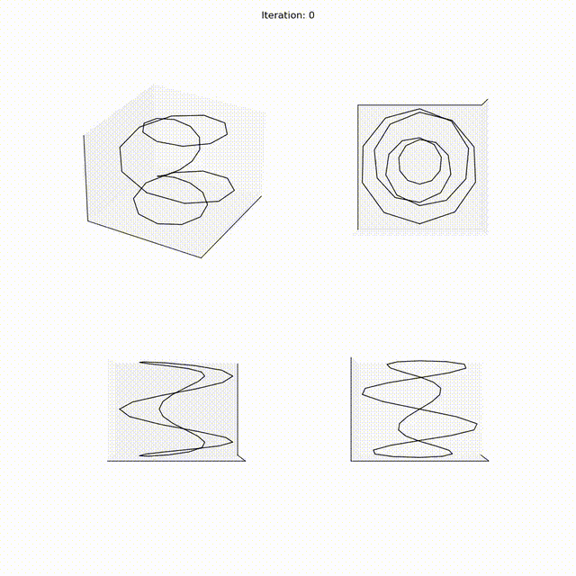

# numerical-knot-untangling

This is an ongoing research project for untangling knots numerically, consisting of the numerical approximation of the Mobius knot energy minimization.  

The implementation consists of two main parts:
1. The Mobius energy gradient computation\
The **Möbius energy** is defined as such:
 $$
\mathcal{E}(\gamma)=\iint _{M^{2}} \frac{1}{|\gamma(u)-\gamma(v) |^{2}}-\frac{1}{d(u,v)^{2}} \, dv \, du 
$$
where:
- $\gamma(u):M\to\mathbb{R}^{3}$ is a parameterized curve representing a knot.
- $u$ is the parameter and denotes a length along $\gamma$
- $d(u,v)$ denotes the shortest distance  between $u$ and  $v$ *along* the curve 

Roughly, since the curve $\gamma$ is completely described by a list of vertices, we use the following system
$$
\begin{bmatrix}
\gamma_{t}^{(1)} \\
\gamma_{t}^{(2)} \\
\vdots \\
\gamma_{t}^{(N)}
\end{bmatrix}=-\begin{bmatrix}
\mathcal{E}_{\gamma^{(1)}} \\
\mathcal{E}_{\gamma^{(2)}} \\
\vdots \\
\mathcal{E}_{^{\gamma^{(N)}}}
\end{bmatrix}
$$

Since we are iterating over a discrete set $M$ of $s$ values representing the indices of our vertices, the discretized energy $\hat{\mathcal{E}}$ is expressed by the following summation
$$
\hat{\mathcal{E}}_{\gamma^{(i)}}= \frac{\partial}{\partial \gamma^{(i)}}\sum_{u}^{N}\sum_{v}^{N} \frac{1}{|\gamma^{(u)}-\gamma^{(v)}|^{2}}- \frac{1}{d(u,v)^{2}}
$$

Which is computed and implemented in [mobius.py](mobius.py) as the function `Mobius_gradient`.

2. The gradient descent algorithm
Implements a simple forward Euler method to compute the gradient descent of the Mobius energy with discretization in time with respect to the above system. 
The scheme includes an dynamic step size which bounds the spatial step size and helps with stability.

The main file is [mobius.py](mobius.py) which the Mobius energy gradient computation. \
The file [config.py](config.py) contains the configuration parameters for the Mobius energy gradient computation such as .obj file and visualization parameters.\
The file [curve.py](curve.py) contains the geometry manipulation function utility functions such as reading obj files.

## Result
### Closed reef knot (two disjoint components)

### Torus knot $T_{4,1}$

